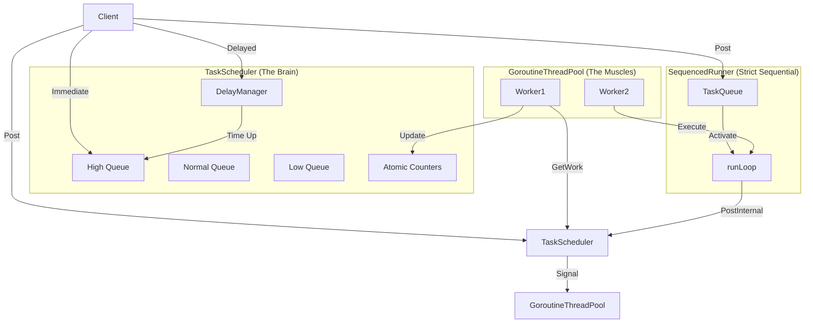

# Task Scheduler Design (Go)

This document details the implementation of a prototype task scheduling system in Golang, referenced from Chromium's `base::TaskScheduler` architecture.

**v2.1 Updates:**

- **Fix**: Resolved `SequencedTaskRunner` potential race conditions and enforced strict sequential execution.
- **Safety**: Added runtime concurrency assertion to `SequencedTaskRunner`.
- **Feat**: Added `PostDelayedTaskWithTraits` interface to support high-priority delayed tasks.
- **Feat**: Implemented `Graceful Shutdown` mechanism to ensure no task loss.
- **Perf**: Optimized `TaskQueue` with Zero-allocation techniques and memory compaction.
- **Ops**: Enhanced observability metrics across the full lifecycle.

## Chapter 1: Basic Units - Task & Traits

We define the basic unit of a task and introduce `TaskTraits` to describe task attributes.

### Core Definitions

```go
package domain

import (
	"context"
	"time"
)

// Task is the smallest unit of execution (Closure)
type Task func(ctx context.Context)

// =============================================================================
// TaskTraits: Define task attributes (priority, blocking behavior, etc.)
// =============================================================================

type TaskPriority int

const (
	// TaskPriorityBestEffort: Lowest priority
	TaskPriorityBestEffort TaskPriority = iota

	// TaskPriorityUserVisible: Default priority
	TaskPriorityUserVisible

	// TaskPriorityUserBlocking: Highest priority
	TaskPriorityUserBlocking
)

type TaskTraits struct {
	Priority TaskPriority
	MayBlock bool
	Category string
}

func DefaultTaskTraits() TaskTraits {
	return TaskTraits{Priority: TaskPriorityUserVisible}
}
```

### Interface Definitions

Updated interfaces to support delayed tasks with traits and monitoring callbacks.

```go
// TaskRunner is the generic interface for posting tasks
type TaskRunner interface {
	PostTask(task Task)
	PostTaskWithTraits(task Task, traits TaskTraits)
	PostDelayedTask(task Task, delay time.Duration)

	// [v2.1 New] Support specific priority for delayed tasks
	PostDelayedTaskWithTraits(task Task, delay time.Duration, traits TaskTraits)
}

// ThreadPool defines the execution engine behaviors
type ThreadPool interface {
	PostInternal(task Task, traits TaskTraits)
	PostDelayedInternal(task Task, delay time.Duration, traits TaskTraits, target TaskRunner)

	// Lifecycle
	Start(ctx context.Context)
	Stop()
	Join()

	// Observability
	WorkerCount() int
	QueuedTaskCount() int
	ActiveTaskCount() int
	DelayedTaskCount() int
}
```

## Chapter 2: Containers - TaskQueue (Optimized)

Adopts aggressive **Zero-allocation** strategies and **Memory Compaction**.

```go
// ... (Imports and constants)

type TaskItem struct {
	Task   Task
	Traits TaskTraits
}

// TaskQueue Interface
type TaskQueue interface {
	Push(t Task, traits TaskTraits)
	Pop() (TaskItem, bool)
	PopUpTo(max int) []TaskItem // Optimized for batch retrieval
	PeekTraits() (TaskTraits, bool)
	Len() int
	IsEmpty() bool
	MaybeCompact()
}

// FIFOTaskQueue Implementation highlights ...
// Uses slice slicing optimization (q.tasks = q.tasks[1:]) and delayed usage of make().
```

## Chapter 3: The Brain - TaskScheduler (Graceful Shutdown & Full Metrics)

Fixed inaccurate monitoring metrics and implemented graceful shutdown.

```go
type TaskScheduler struct {
	// ... Internal queues and delay manager
	queues [3]TaskQueue // High, Normal, Low
	
	// Metrics
	metricQueued  int32
	metricActive  int32
	metricDelayed int32
	
	// ... Lifecycle fields
}

// PostInternal delegates to the appropriate queue based on priority
func (s *TaskScheduler) PostInternal(task Task, traits TaskTraits) {
    // ... Checks shutdown state
    // ... Pushes to queue[priority]
    // ... Signals workers
}

// Shutdown Process
// 1. Mark as shutting down.
// 2. Stop DelayManager.
// 3. Wait for queues to drain.
// 4. Cancel workers.
```

## Chapter 4: The Muscles - GoroutineThreadPool

Manages a pool of workers that pull from the `TaskScheduler`.

```go
type GoroutineThreadPool struct {
	workers   int
	scheduler *domain.TaskScheduler
	// ...
}

func (tg *GoroutineThreadPool) workerLoop(id int, ctx context.Context) {
	for {
		// Pull tasks from Scheduler
		task, ok := tg.scheduler.GetWork(ctx.Done())
		if !ok {
			return
		}

		tg.scheduler.OnTaskStart()
		
		func() {
			defer tg.scheduler.OnTaskEnd()
			// Execute task
			task(ctx)
		}()
	}
}
```

## Chapter 5: Scheduler - SequencedTaskRunner (Strict Sequential)

**Core Fix (v2.1):** Rewritten `runLoop` to process exactly **one** task at a time. This ensures `TaskTraits` are re-evaluated between tasks, allowing for precise priority inheritance and yielding.

**Safety:** Added `atomic` assertion to guarantee strictly non-concurrent execution of the sequence.

```go
type SequencedTaskRunner struct {
	threadPool    ThreadPool
	queue         TaskQueue
	mu            sync.Mutex
	isRunning     bool
	activeRunners int32 // atomic guard
}

func (r *SequencedTaskRunner) runLoop(ctx context.Context) {
	// Assertion: Ensure strictly one goroutine at a time
	if n := atomic.AddInt32(&r.activeRunners, 1); n > 1 {
		panic(fmt.Sprintf("SequencedTaskRunner: concurrent runLoop detected (count=%d)", n))
	}
	defer atomic.AddInt32(&r.activeRunners, -1)

	// 1. Fetch SINGLE task
	item, ok := r.queue.Pop()

	if !ok {
        // ... Handle empty queue and race conditions ...
		return
	}

	// 2. Execute ONE task
	item.Task(ctx)

	// 3. Always repost if there are more tasks (Yield)
	// This ensures we yield to the Scheduler between every task
    // allowing higher priority global tasks to interleave.
	if more {
		r.rePostSelf(nextTraits)
	}
}
```

## Chapter 6: Delayed Tasks - DelayManager

`DelayManager` is built into `TaskScheduler`, responsible for delayed tasks and updating metrics. It uses a Heap to efficiently manage time-based events.

## Chapter 7: Integration - JobManager

`JobManager` allows submitting jobs which are wrapped into Tasks and posted to the appropriate Runner.

## Chapter 8: SequencedRunner Priority Semantics

1.  **Strict FIFO**: `SequencedTaskRunner`'s primary guarantee is execution order. Even if a High Priority task is inserted, it must wait for preceding tasks in the sequence.
2.  **Scheduling Priority**: Trait Priority determines **"when the Sequence itself gets scheduled by the ThreadPool"**.
    *   If the next task in the sequence is High Priority, the `runLoop` is posted to the scheduler with High Priority.
    *   This sequence competes with other sequences based on this priority.
    *   Once scheduled, it executes **one** task, then yields, re-evaluating the priority for the next task.

## Summary: Architecture Overview

